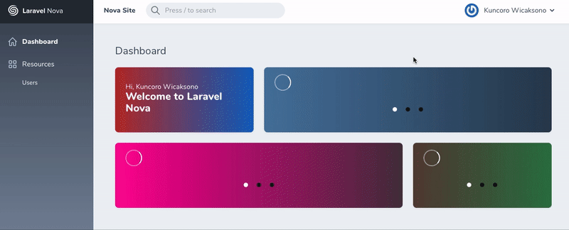
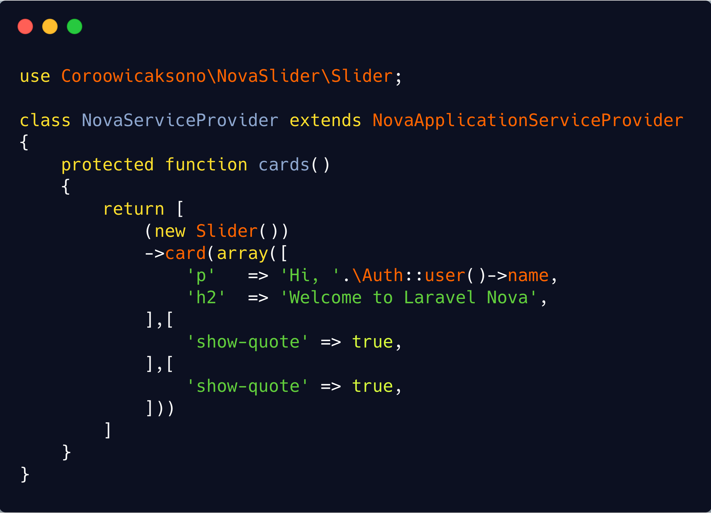
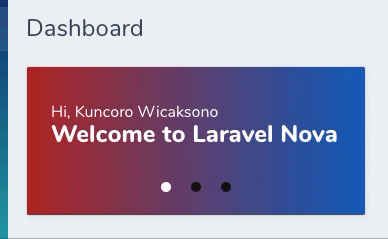

# Getting Started

## Requirements

This Nova Carousel requires `Nova 2.0 or higher`



## Installation

You can install the package via composer:

```bash
composer require coroowicaksono/nova-carousel
```

<!-- panels:start -->

<!-- div:title-panel -->

## Basic Usage

Open your `App\Providers\NovaServiceProvider.php` as a default dashboard for Laravel Nova and edit `cards` function:

<!-- div:left-panel -->




Result :



<!-- div:right-panel -->

```php
use Coroowicaksono\NovaCarousel\Slider;
```

```php
(new Slider())
    ->card(array([
        'p'  => 'Hi, '.\Auth::user()->name,
        'h2' => 'Welcome to Laravel Nova',
    ],[
        'show-quote' => true,
    ],[
        'show-quote' => true,
    ]))
    ->width('1/3'),
```

<!-- panels:end -->

# Configuration

## Basic Configuration
Some basic configuration can be found here:

### autoplay
Flag to enable autoplay<br/>
Type: `Boolean`<br/>
Default: `true`

### autoplayTimeout
Time elapsed before advancing slide<br/>
Type: `Number`<br/>
Default: `2000`

### autoplayHoverPause
Flag to pause autoplay on hover<br/>
Type: `Boolean`<br/>
Default: `true`

### easing
Transition speed between slides. Any valid CSS transition easing is accepted.<br/>
Type: `String`<br/>
Default: `ease`

### minSwipeDistance
Minimum distance in pixels to swipe before a slide advance is triggered<br/>
Type: `Number`<br/>
Default: `8`

### perPage
Maximum number of slides displayed on each page<br/>
Type: `Number`<br/>
Default: `2`

### scrollPerPage
Scroll per page, not per item.<br/>
Type: `Boolean`<br/>
Default: `false`

## Navigation
Configure the navigation component (next/prev buttons)

### navigationEnabled
Type:<br/>
Default: `false`

### navigationClickTargetSize
Amount of padding to apply around the label in pixels<br/>
Type: `Number`<br/>
Default: `8`

### navigationNextLabel
Text content of the navigation next button<br/>
Type: `String`<br/>
Default: `▶`

### navigationPrevLabel
Text content of the navigation prev button<br/>
Type: `String`<br/>
Default: `◀`

## Pagination

### paginationEnabled
Configure the pagination component (clickable page dots)<br/>
Type: `Boolean`<br/>
Default: `true`

### paginationActiveColor
The fill color of the active pagination dot. Any valid CSS color is accepted.<br/>
Type: `String`<br/>
Default: `#000000`

### paginationColor
The fill color of pagination dots. Any valid CSS color is accepted.<br/>
Type: `String`<br/>
Default: `#efefef`

### paginationPadding
The padding inside each pagination dot. Pixel values are accepted.<br/>
Type: `Number`<br/>
Default: `10`

### paginationSize
The size of each pagination dot. Pixel values are accepted.<br/>
Type: `Number`<br/>
Default: `10`

# More Reference 

[Vue-Carousel](https://ssense.github.io/vue-carousel/api/)

# Issue 

For any issue, we capture it in [HERE](https://github.com/coroo/nova-carousel/issues).

# ChangeLog

Please see [CHANGELOG](https://github.com/coroo/nova-carousel/blob/master/CHANGELOG.md) for more information on what has changed recently.

# Suport Us

<a href="https://www.buymeacoffee.com/coroowicaksono" target="_blank"></a> Or rate us <a href="https://github.com/coroo/nova-carousel/stargazers"></a>

# Contribute

Be one of our contributor at [contributor](https://github.com/coroo/nova-carousel/blob/master/CONTRIBUTING.md).

# License

The MIT License (MIT). Please see [License File](https://github.com/coroo/nova-carousel/blob/master/LICENSE) for more information.

